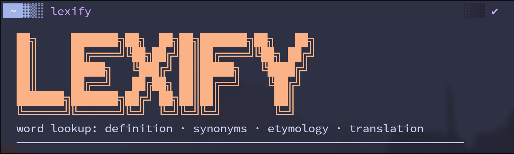

CLI tool for English word lookup: definition, synonyms, etymology, and optional translation into other languages. No API keys required.


## Installation

Requires Go 1.21+.

```sh
go install github.com/bk-bf/lexify@latest
```

The binary lands in `$GOPATH/bin` (typically `~/go/bin`) — ensure that is on your `$PATH`.

<details>
<summary>Build from source</summary>

```sh
git clone https://github.com/bk-bf/lexify.git
cd lexify
go build -o lexify .
```

</details>


## Usage

```
lexify <word>
lexify <word> <lang> [lang ...]
```

| Flag        | Description                                                    |
| ----------- | -------------------------------------------------------------- |
| `-i <lang>` | Install an offline pack for the given language                 |
| `--kaikki`  | Pack source: kaikki.org JSONL (~500 MB, ~2 min) — default      |
| `--wiki`    | Pack source: en.wiktionary.org XML dump (~1.2 GB, ~10 min)     |
| `-o`        | Use installed offline pack instead of live APIs for EN lookups |
| `-d`        | Show per-fetch debug timing                                    |

Pass any BCP-47 language code as `<lang>`:
`fr` `ru` `de` `es` `it` `pt` `ja` `zh` `ko` `ar` `nl` `pl` `sv` `tr` `uk` `hi` …

Unrecognised language codes are dropped with an inline warning; output falls back to English.


## Examples

```sh
# English only
lexify serendipity

# With translation (definition, synonyms, etymology rendered in French)
lexify serendipity fr

# Multiple target languages
lexify serendipity fr ru

# Non-English source word — detected automatically, translated to EN, then looked up
lexify Schadenfreude en

# Use offline pack (requires lexify -i en first)
lexify serendipity -o
lexify serendipity de -o
```


## Offline packs

Packs are installed per-language into `~/.local/share/lexify/` as a binary-search index (`<lang>.idx` + `<lang>.dat`).

```sh
lexify -i en           # install English pack (~2 min from kaikki.org)
lexify -i en --wiki    # same, from Wiktionary XML dump (~10 min)
lexify -i de           # install German pack
```

With `-o`, EN lookups (definition, synonyms, etymology) are served from the local index (~27 ms) instead of live API calls. If the word is not found in the pack the tool falls back to the APIs and marks this in output with `⚠ pack miss → api`.

When a target-language pack is installed, synonym lookups for that language are also served from the pack; definition and etymology content is still translated via API since the pack stores English-sourced glosses for non-EN words, not native-language prose.


## Data sources

| Section                                  | Source                                               |
| ---------------------------------------- | ---------------------------------------------------- |
| Definition (EN)                          | Offline pack — or — dictionaryapi.dev                |
| Synonyms (EN)                            | Offline pack — or — datamuse.com                     |
| Etymology (EN)                           | Offline pack — or — en.wiktionary.org `action=parse` |
| Synonyms (target lang)                   | Installed pack — or — target-lang Wiktionary API     |
| Translation (word)                       | Google Translate `gtx` endpoint; MyMemory fallback   |
| Translation (definition, etymology text) | Google Translate `gtx` endpoint                      |

All packs are built from [kaikki.org](https://kaikki.org) or the [Wiktionary XML dump](https://dumps.wikimedia.org/enwiktionary/).


## Implementation notes

**Concurrency** — Phase 1 fires goroutines for EN lookup (pack or API), and all word translations simultaneously. Phase 2 fans out immediately on Phase 1 results: per-language synonym fetches and text translations run without a second barrier. Use `-d` to see per-task timing split by phase.

**Wiktionary parsing** — Uses the `action=parse` two-step API (section index → wikitext by section number). Wikitext templates (`{{m}}`, `{{der}}`, `{{bor}}`, `{{suffix}}`, `{{w}}`, …) are resolved before display.

**Multilingual synonyms** — Section headings matched with a single regex covering `Synonyms`, `Synonymes`, `Synonyme`, `Синонимы`, `Sinónimos`, `同義語`, `동의어`, `مرادف`, and others.

**Unicode** — String widths and substring operations use rune slices throughout, so Cyrillic, CJK, Arabic, and other scripts wrap correctly.

**Non-EN source words** — If a word returns no definition, the tool translates it to English via GTX and retries the lookup in English (pack or API). The header shows `<original> → <translated>` when this path is taken.


